# docker-pgadmin

Pgadmin4 is a web-based administrative tool for PostgreSQL.

I set this instance of pgadmin4 specifically to examine Esri ArcGIS Portal and DataStore tables.
There is nothing special about it except a few usage notes regarding Esri products
in this README.

It's as a simple as I could make it. It's built on the official image.

# INSTALL
``` bash
curl  -L -o install-pgadmin.sh https://raw.githubusercontent.com/say-84/docker-pgadmin/main/install-pgadmin.sh  && chmod +x install-pgadmin.sh && ./install-pgadmin.sh
```

## Configure

For web access you need to define a username and password, that is done in the .env file.
Copy the sample file and edit it.

   cp sample.env .env

Now edit .env to set username and password.

## Deploy

Start it up,

   docker compose up -d
  
Access it on port 8123 via browser. The port is set in the compose.yaml file
and I chose 8123 totally arbitrarily.

## Usage

Give this link a try. http://cc-testmaps:8123/

Once you have it up in a browser window, refer to the docs for pgadmin4.

### Portal

If pgadmin and your target PostgreSQL servers are on separate machines
you have to add a line to pg_hba.conf on the PostgreSQL server(s). The
file for Portal on Windows is in C:/arcgis/arcgisportal/db and the
line I added to give my dockerized pgadmin access was

```bash
host  all     arcgis     10.10.10.210/32 scram-sha-256
```

The Portal PostgreSQL instance runs at port 7654.

The column with USER in it needs to have your admin user in it, in this sample it's "arcgis".
The IP address needs to be the one for the machine where pgadmin runs.

Typos in pg_hba.conf will prevent Portal from functioning. Back up before editing.

### DataStore

You have to access Data Store using the "sde" account.

You can find your DataStore password for sde by running listadminusers on the server it's installed on,
for Windows it's in C:/Program Files/ArcGIS/DataStore/tools. (Run as administrator)

The DataStore PostgreSQL instance runs at port 9876.

If your DataStore and your pgadmin are on separate machines you have
to add a line to pg_hba.conf and then restart the Datastore. The file
on Windows is in C:/arcgisdatastore/pgdata and then line I
added to give my dockerized pgadmin access was this:

```bash
host  all     sde     10.10.10.210/32 scram-sha-256
```

This gives access only to the machine living at 10.10.10.210 and requires a password.

After you edit pg_hba.conf you must restart the PostgreSQL server,
I do that by restarting the ArcGIS Datastore service, not the whole machine.

Caveat Emptor: 
Note that if you get this line wrong, your PostgreSQL instance will
not restart, the ArcGIS Datastore will say that it restarted but when
you check the logs it will tell you there is an error in the file.

## Pgadmin 4 screenshots after successful installation.

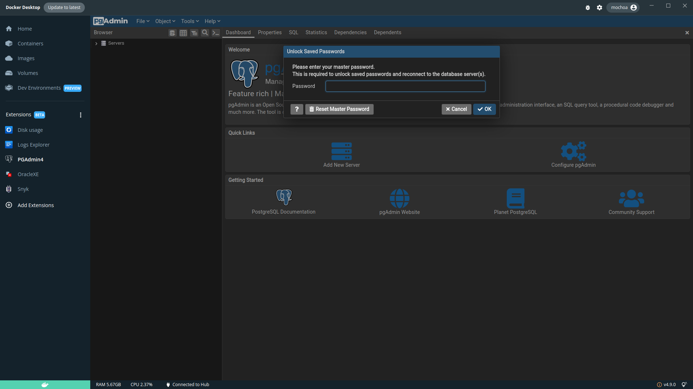

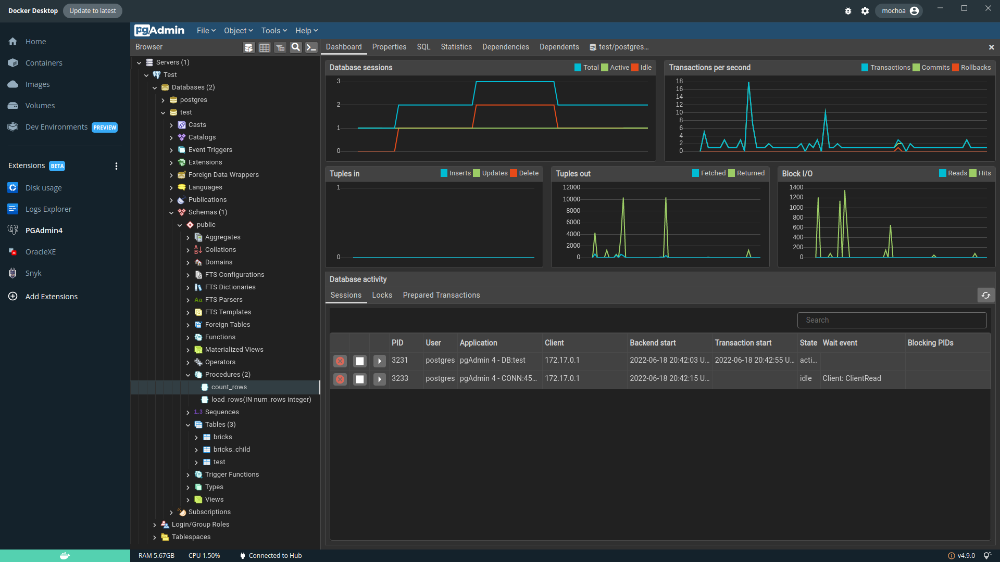

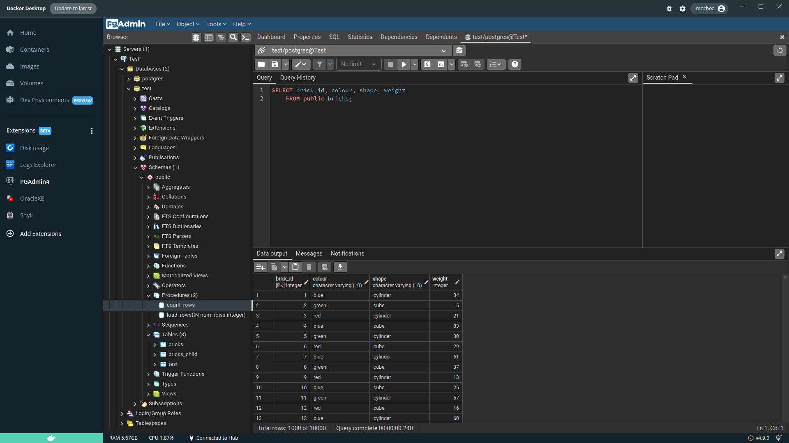

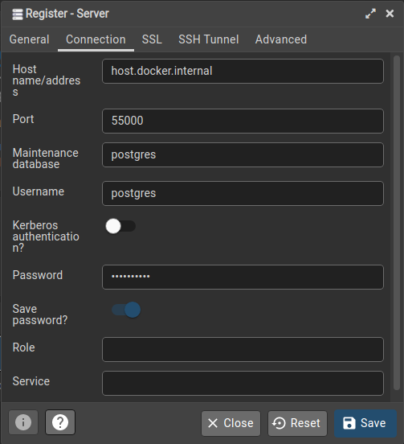

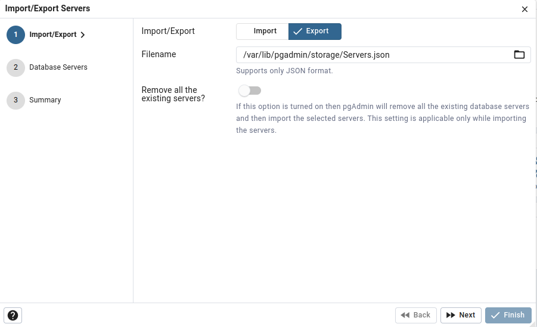

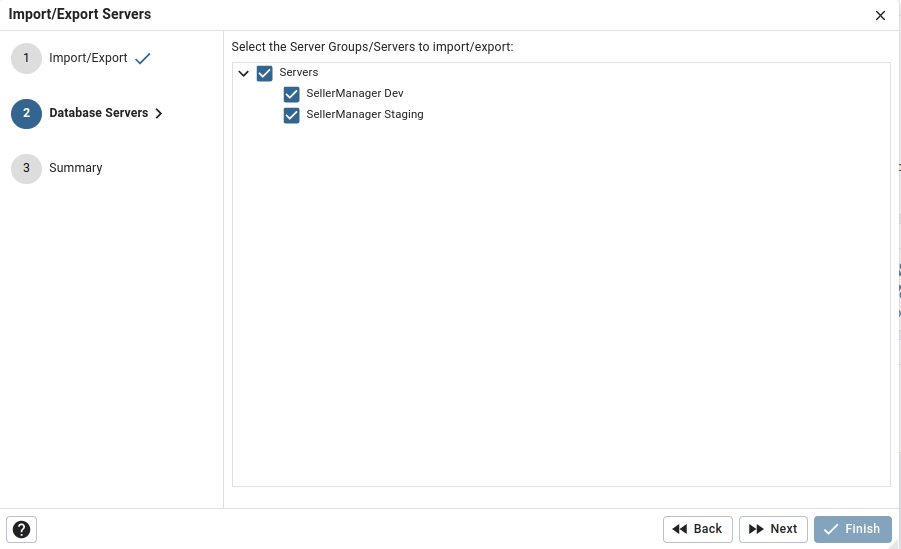

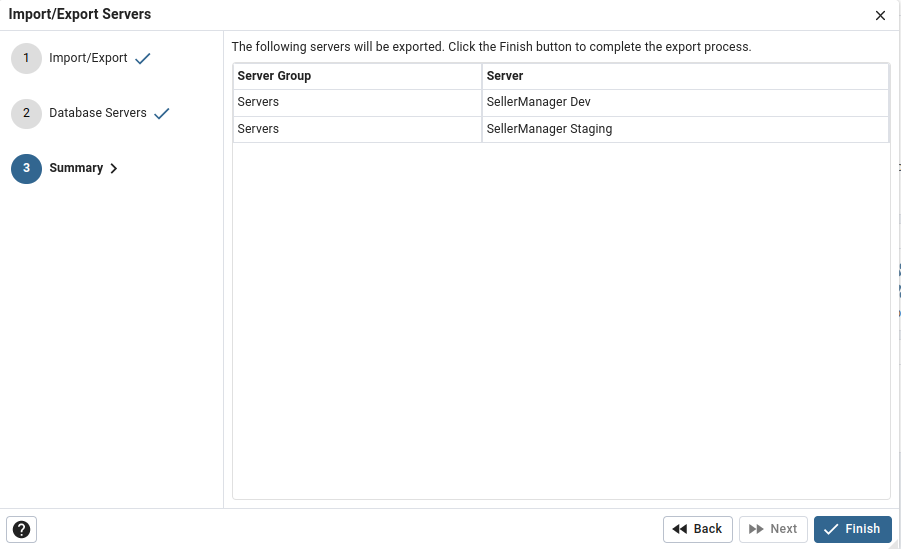

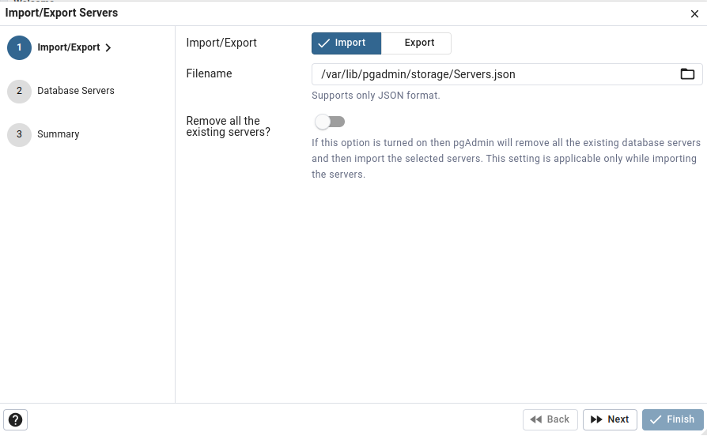

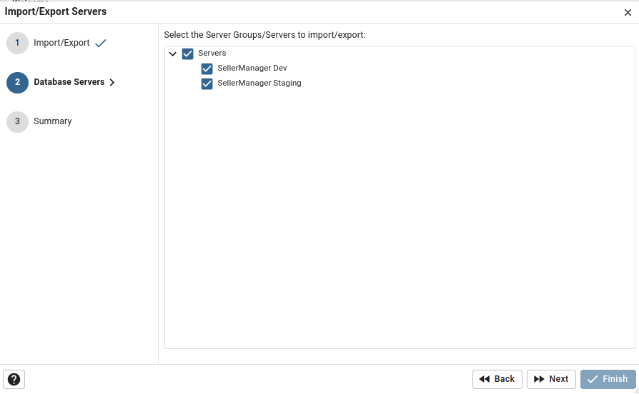

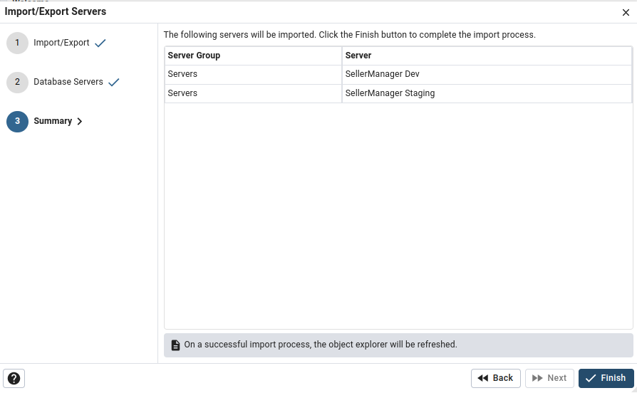

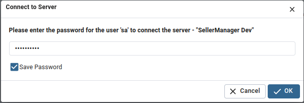
